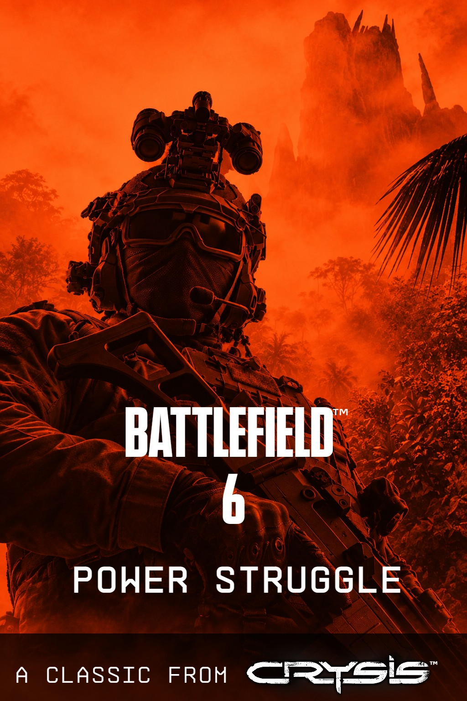

# Power Struggle

<p align="center">
  
</p>

A Battlefield 6 Portal game mode (TypeScript) inspired by Crysis Wars' Power
Struggle. Two teams, **NATO (team 1)** and **PAX (team 2)**, fight over bunkers,
energy sites and factories. Holding them earns prestige and powers up the
Prototype Factory. The match is won by blowing up the enemy HQ with the Rorsch
railgun.

> Status: work in progress on a test map (`PS_Isolated`). Numbers below are
> testing values from `src/config.ts` and will be tuned.

## How a match plays

### 1. Capture the map

| Objective | How it's captured | What it gives |
|---|---|---|
| **Bunkers** (3) | Native Conquest capture point (20 s) | A forward spawn in the normal deploy menu; 150 prestige |
| **Energy sites** (3) | Stand in the area; custom capture (20 s) | Charges your Prototype Factory; 200 prestige |
| **Prototype Factory** (1) | Custom capture | Required for your team's power to charge at all |
| **War / Aviation / Naval factories** | Custom capture | Lets your team buy vehicles there; 250 prestige |

Custom captures work like Crysis: only one team in the area advances the bar,
the other team's progress decays, and a contested area freezes. Only the players
standing in the area when it flips get paid.

### 2. Earn prestige and spend it

Prestige is the spendable currency: kills (50), assists (25) and captures
(above). The scoreboard score is tracked separately and can't be spent.

The **buy menu** opens from the Portal gadget and has these tabs:

- **Weapons**: prototype tier (MOAC, ...) and standard tier (Gauss rifle = the
  Rorsch Mk 2, ...).
- **Equipment** and **Add-ons**: tools, ammo, scopes.
- **Factory**: buy a vehicle at a factory your team owns. It spawns on a free
  pad. A placed vehicle spawner that is still tied to an earlier vehicle is
  replaced by a spawner created at runtime, so a purchase only fails when every
  pad is physically blocked; if nothing appears, the prestige is refunded.
- **Tactical**: a list of every strategic location showing Friendly / Enemy /
  Neutral. Picking one highlights its world icon for you only.

### 3. Charge power

A team that owns the **Prototype Factory** charges its **Power Level** from 0 to
100%. Each energy site it holds speeds this up (1.5× per site; 0 sites = no
charge). Both teams are told when either side passes 50%, 75% and 100%.

### 4. Break the base

Each team has three **rocket sites** (`src/rocketsites/`): a radar and a
battery of missile silos. A human enemy entering a site's kill zone is warned,
locked by the radar for 3 seconds, then hit by a homing rocket that cannot be
escaped, on foot or in any vehicle. Bots are ignored. A site falls to 8 hits
on its radar from unguided, high-explosive or aim-guided rocket launchers, and
stays down for the rest of the match.

The **Rorsch** is a raygun: it charges for about 2 seconds and fires a hitscan
shot. From anywhere, the shot:

- **destroys an enemy rocket site in one hit** when it passes through its
  radar. Once 2 of a team's sites are down, its HQ is open, and both teams
  are told;
- **damages an open enemy HQ** when it lands within 350 m of it. 3 hits
  (100 → 67 → 33 → 0%) destroy it, and that team **loses the match**.

Wherever it lands, every Rorsch impact is a small tactical nuke, friendly fire
included: anyone within 35 m dies, anyone within 55 m takes heavy damage and
burns (with a flash, ringing and a disoriented few seconds), and players within
150 m see it. Nearby players hear an alarm while the Rorsch charges. A purchase
holds two shots; the Rorsch is taken away after the second, and dropping it and
picking it back up does not refill it.

## Bots

Each team is filled with up to 32 script-controlled bots (`src/bots*.ts`),
leaving room for the humans on that team. Bots stay in the game when they die
and redeploy as the same soldier, so their name and scoreboard row last the
whole match. Some deploy straight onto a bunker their team owns. Every few
seconds each bot scores every objective and picks one:

- **attack** anything its team doesn't own;
- **defend** an owned objective with enemies nearby;
- **hold** a safe one for a while, then **roam** to another.

Bots heading to the same place count against it, so the team spreads out. Long
walks follow a waypoint graph built from small props placed on the map (ObjIds
9000-9199, read from the map export at build time); a route a bot swam on or got
stuck on becomes more expensive for everyone. A bot that can't reach an
objective skips it for 90 s, and one stuck in place for a while jumps, re-plans,
and as a last resort respawns. When shot, a bot fights for 10 s, then goes back
to its objective.

Vehicles: bots with a long trip get into a free vehicle nearby and drive or fly
it toward their objective. Teammate bots near a player's vehicle that has
landed or stopped climb in as passengers, ride along, and get out once the
player has carried them somewhere and stopped.

## Project layout

| Path | What it is |
|---|---|
| `src/index.ts` | Entry point: HUD, buy menu, events |
| `src/capture.ts`, `energy.ts`, `factory.ts` | Custom capture, energy sites, power charge |
| `src/spawns.ts` | Bunker capture points and spawning |
| `src/nuke.ts`, `rorschshot.ts`, `nukefx.ts`, `rorschammo.ts` | Rorsch shot detection, the nuke, Rorsch ammo |
| `src/rocketsites/`, `sitewire.ts`, `hq.ts` | Rocket sites (`sitemap.ts` is generated), their link to the mode, HQ damage and the win |
| `src/winner.ts` | End-of-match rules |
| `src/bots.ts`, `botbrain.ts`, `botscore.ts`, `botobjectives.ts`, `botnames.ts` | Bot AI |
| `src/botnav.ts`, `botnavgraph.ts`, `navpoints.ts` | Waypoint graph and routing (`navpoints.ts` is generated) |
| `src/slots.ts` | Vehicle purchases, pads and runtime spawners |
| `src/objids.ts` | The map's object IDs (see `PS_ObjIds.md`) |
| `src/config.ts` | Every tunable number |
| `src/strings.json` | All on-screen text |
| `PS_Isolated.tscn` / `.spatial.json` | The Godot test map and its Portal export |
| `ps_poster_1.jpg` | Poster art |
| `scripts/` | Node unit tests for the pure modules, and the build guard |
| `dist/` | Built output to upload to Portal |

## Building

The build expects this folder to sit next to `main_resources/` (the Portal SDK
type definitions and `bf6-portal-utils`), as in the original workspace.

```bash
npm install
npm run build
```

`npm run build` regenerates the waypoint table from the map export, runs the
source guard and unit tests, type-checks, bundles, and type-checks the bundle. Upload `dist/bundle.ts` and `dist/bundle.strings.json`
to the Portal web editor together with the map export.

## Credits

- [**bf6-portal-utils**](https://github.com/deluca-mike/bf6-portal-utils) by
  deluca-mike: the utility library this mode is built on (events, timers,
  logging, performance stats, callback handler, player locations, vectors and the
  player undeploy fixer).
- [**bf6-portal-bots-brain**](https://github.com/nikgodda/bf6-portal-bots-brain/tree/main)
  by nikgodda: ideas behind the bot AI, in particular handing a shot bot to the
  combat AI for a short time and steering bot-driven vehicles toward an objective.
- [**bf6-portal-ui-preview**](https://github.com/nadorjozsef/bf6-portal-ui-preview)
  by nadorjozsef: used to preview the HUD and buy menu layouts during development.

## License

[MIT](LICENSE). `dist/bundle.ts` also contains code from bf6-portal-utils, which
is MIT licensed, Copyright (c) 2026 Michael De Luca.
